## Índice

0. [Ficha del proyecto](#0-ficha-del-proyecto)
1. [Descripción general del producto](#1-descripción-general-del-producto)
2. [Arquitectura del sistema](#2-arquitectura-del-sistema)
3. [Modelo de datos](#3-modelo-de-datos)
4. [Especificación de la API](#4-especificación-de-la-api)
5. [Historias de usuario](#5-historias-de-usuario)
6. [Tickets de trabajo](#6-tickets-de-trabajo)
7. [Pull requests](#7-pull-requests)

---

<br>

## 0. Ficha del proyecto

### **0.1. Tu nombre completo:**

Enrique Reaño Fazio

### **0.2. Nombre del proyecto:**

CalendarSchool

### **0.3. Descripción breve del proyecto:**

**CalendarSchool** es un sistema integral de gestión de horarios escolares que automatiza la creación, validación y asignación de calendarios académicos, restricciones de carga horaria, y generación de horarios optimizados para centros educativos. Resuelve la compleja tarea de generar horarios respetando múltiples restricciones (disponibilidad de profesores, ubicación física única, carga horaria equilibrada) mediante algoritmos de optimización (CSP/Backtracking) y proporciona herramientas de auditoría y cumplimiento normativo (GDPR).

**Stack tecnológico:**
- **Backend:** Node.js 24 LTS + TypeScript + Express.js
- **Frontend:** React 19 + TypeScript + Bootstrap 5.3 (Vite)
- **Base de Datos:** PostgreSQL + Prisma ORM
- **Testing:** Vitest + Supertest + Cypress (E2E)
- **Deployment:** AWS Lambda + Serverless Framework

**Usuarios objetivo:** Jefe de Estudios, Directores, Profesores, Alumnos  
**Alcance MVP:** 240+ casos de uso (7 historias de usuario principales)


### **0.4. URL del proyecto:**

PENDIENTE

### 0.5. URL o archivo comprimido del repositorio

https://github.com/kiketon007/CalendarSchool

---

<br>

## 1. Descripción general del producto

### **1.1. Objetivo:**

**Automatizar la generación de horarios escolares** eliminando el proceso manual que consume 20-40 horas semanales de trabajo administrativo en centros educativos. CalendarSchool proporciona:

- **Generación optimizada de horarios:** Algoritmos CSP (Constraint Satisfaction Problem) y Backtracking que respetan todas las restricciones académicas
- **Validación de restricciones críticas:** Garantiza que profesores no estén en 2 aulas simultáneamente (SINGLE_LOCATION), carga horaria equilibrada, disponibilidad de profesores
- **Auditoría y cumplimiento normativo:** Trazabilidad completa de cambios, soft delete GDPR-compliant, control de sesiones con revocación de tokens JWT
- **Gestión centralizada:** Dashboard único para configurar calendarios, asignaturas, restricciones y revisar horarios generados

**Para quién:** Jefes de Estudios, Directores, Coordinadores de Horarios que necesitan generar horarios fiables en horas (vs días o semanas manualmente)

**Valor aportado:**
- Ahorro de 20-40 horas/semana en trabajo manual
- Reducción de errores de planificación (0 conflictos HC-validados)
- Flexibilidad: cambios rápidos en restricciones → regeneración automática
- Cumplimiento normativo: auditoría completa, GDPR, control de acceso

### **1.2. Características y funcionalidades principales:**

#### **Módulo 1: Autenticación y Control de Acceso (US01-US03)**
- ✅ Autenticación JWT con refresh tokens persistentes
- ✅ Revocación de tokens por logout, cambio de contraseña, o logout forzado por admin
- ✅ Roles: Jefe de Estudios, Director, Profesor, Alumno
- ✅ Auditoría de sesiones (IP, user-agent, timestamps)

#### **Módulo 2: Gestión de Calendarios Base (US-BASE)**
- ✅ Configuración de calendario escolar (fecha inicio/fin, jornada horaria)
- ✅ Auto-generación de sesiones (1-8 por día, configurable)
- ✅ Soporte para recreos/breaks
- ✅ Validación: no solapamientos, máximo 90 min/sesión
- ✅ Edición post-uso con notificaciones de impacto

#### **Módulo 3: Gestión de Materias (US-SUBJECT)**
- ✅ CRUD de asignaturas (CORE, ELECTIVE, CUSTOM)
- ✅ Asociación N:M a cursos (una materia en múltiples cursos)
- ✅ Cascada automática: cambio en materia → regenerar horarios
- ✅ Soporte para soft delete GDPR

#### **Módulo 4: Restricciones de Carga Horaria (US19)**
- ✅ 4 tipos de restricciones: HOURS_PER_WEEK, AVAILABILITY, NO_DUPLICATE, SINGLE_LOCATION
- ✅ Validación CRÍTICA SINGLE_LOCATION: profesor no en 2 aulas mismo día/sesión
- ✅ Configuración bulk por grupo (matriz editable con todas asignaturas)
- ✅ Avisos dinámicos (ej: suma > 25 franjas)
- ✅ Cascada: cambio restricción → marca horarios NEEDS_REVIEW

#### **Módulo 5: Visualización de Restricciones (US20)**
- ✅ Listado filtrable de restricciones activas (tipo, curso, status)
- ✅ Búsqueda case-insensitive sin acentos (US11)
- ✅ Barra visual de disponibilidad con código de colores
- ✅ Hover con desglose de restricciones
- ✅ Responsive: desktop, tablet, móvil

#### **Módulo 6: Disponibilidad de Profesores (US-PROF-AVAIL)**
- ✅ Grid visual: Lun-Vie × Sesiones (marcar disponible/no disponible)
- ✅ Botones conveniencia: Marcar Todo, Solo Mañana, Solo Tarde, Inversión
- ✅ Display: franjas disponibles + barra visual %
- ✅ Validación: no más de X sesiones simultáneas

#### **Módulo 7: Asignación de Asignaturas (US-PROF-ASSIGN)**
- ✅ Profesor + Asignatura + Cursos + Sesiones/Semana
- ✅ Cálculo dinámico: cursos × sesiones = total sesiones
- ✅ Validaciones: no duplicados, no mismatch restricción, disponibilidad suficiente
- ✅ Avisos permitidos (sobrecarga) → horarios marked NEEDS_REVIEW

#### **Módulo 8: Resumen de Carga (US-PROF-SUMMARY)**
- ✅ Tabla maestro: Profesor | Asignaturas | Total Sesiones | Disponibilidad | Estado
- ✅ Indicador color: 🟢 OK (0-75%), 🟡 Aviso (75-100%), 🔴 Error (>100%)
- ✅ Expandible: detalles, timeline, advertencias
- ✅ Acciones rápidas: editar disponibilidad/asignaciones
- ✅ Exportar CSV

#### **Módulo 9: Generación de Horarios (US-ALGO - Futuro)**
- ✅ Algoritmo CSP/Backtracking configurable
- ✅ Job queue con progreso en tiempo real
- ✅ 7 vistas de detección automática de conflictos:
  - professor_overlap (profesor en 2 aulas)
  - no_room (asignación sin aula)
  - availability (fuera de disponibilidad)
  - professor_load (carga horaria)
  - professor_availability_summary (% disponible)
  - restriction_audit_trail (auditoría restricciones)
- ✅ Descarga horarios (PDF, Excel)

#### **Seguridad & Auditoría**
- ✅ Control JWT con refresh tokens revocables
- ✅ Auditoría completa: createdBy/updatedBy en 7 tablas
- ✅ Soft delete GDPR: deletedAt en profesores, materias, calendarios
- ✅ Validaciones Hard Constraints (HC1-HC6) en schema
- ✅ Triggers automáticos: marcar conflictos en cambios
- ✅ Índices optimizados: búsqueda case-insensitive, performance O(log n)

### **1.3. Diseño y experiencia de usuario:**

PENDIENTE

### **1.4. Instrucciones de instalación:**

**Requisitos:** Node.js 24 LTS (versión fijada en `.nvmrc`), npm 11 y Docker con Docker Compose. En Windows, clona primero el repositorio con soporte de enlaces simbólicos (ver *Clonado del repositorio* más abajo).

**Instalación y arranque local:**

1. Instala las dependencias. También genera el cliente Prisma, aunque todavía no exista `backend/.env`:

   ```bash
   npm install
   ```

2. Crea el fichero de entorno del backend a partir de la plantilla. Sus credenciales son solo de desarrollo local y coinciden con `docker-compose.yml`:

   ```bash
   cp backend/.env.example backend/.env              # bash
   Copy-Item backend/.env.example backend/.env       # PowerShell
   ```

3. Levanta PostgreSQL 18, que crea las bases `calendarschool` (desarrollo) y `calendarschool_test` (tests):

   ```bash
   docker compose up -d
   ```

4. Aplica las migraciones a la base de desarrollo. Nunca se aplican de forma implícita: repite este paso tras traer migraciones nuevas.

   ```bash
   npm run db:migrate
   ```

5. Arranca backend y frontend en paralelo. El frontend está en `http://localhost:5173` y redirige `/api/*` al backend (`http://localhost:3000`):

   ```bash
   npm run dev
   ```

   Comprobación: `http://localhost:5173/api/health` responde `{"success":true,"data":{"status":"ok","database":"up"}}`.

**Tests y calidad:**

| Comando | Qué hace |
|---|---|
| `npm test` | Tests unitarios y de integración del backend y tests del frontend, con cobertura (90 % backend, 80 % frontend). Requiere PostgreSQL levantado. |
| `npm run test:unit` | Tests sin base de datos (backend unitario y frontend). |
| `npm run test:e2e` | Compila, migra el esquema `public` de la base de test, arranca el backend en `:3001` y `vite preview` en `:4173` y ejecuta Cypress en modo headless. Es el mismo script que usa CI. |
| `npm run lint` / `npm run format` | ESLint y Prettier sobre `backend` y `frontend`. |
| `npm run build` | Build de ambos workspaces. |

Al hacer commit, un hook (husky + lint-staged) corrige y formatea los ficheros modificados de `backend/` y `frontend/`, y bloquea el commit si quedan errores de lint.

**Problemas frecuentes:**

- **No existe `calendarschool_test`.** El script que la crea solo se ejecuta al crear el volumen de Docker por primera vez. Si el volumen ya existía, recréalo (se pierden los datos locales): `docker compose down -v` y `docker compose up -d`.
- **El puerto 5432 está ocupado.** Otro PostgreSQL (por ejemplo, el contenedor de otro proyecto) lo está usando: páralo antes de `docker compose up -d`. Si el contenedor de este proyecto arrancó sin el puerto publicado (`docker ps` no muestra `0.0.0.0:5432->5432/tcp`), recréalo con `docker compose up -d --force-recreate`.
- **`npm run test:e2e` falla con «El puerto 3001 (o 4173) está ocupado».** Cierra el proceso que lo usa. El E2E puede ejecutarse con `npm run dev` en marcha, porque usa otros puertos.
- **Cypress se cae («Renderer process crashed» o «heap out of memory»).** Falta memoria libre en la máquina: cierra aplicaciones y repite. El E2E tiene un tiempo máximo de 10 minutos (`E2E_CYPRESS_TIMEOUT_MS`) para no quedarse colgado.
- **Aparece `lint-staged automatic backup` en `git stash list`.** En Windows, cuando el hook bloquea un commit, lint-staged puede no borrar su copia de seguridad. No se pierde nada: comprueba con `git diff stash@{0}` que coincide con tu árbol de trabajo y elimínala con `git stash drop`.

**Clonado del repositorio (enlaces simbólicos):** los agentes y skills de IA viven en `ai-specs/` y se exponen en `.claude/` y `.cursor/` mediante enlaces simbólicos. En Windows, Git los convierte en ficheros de texto si no se habilitan, y las skills y agentes dejan de funcionar. Antes de clonar:

1. Activa el **Modo de desarrollador** de Windows (Configuración → Sistema → Para programadores) o ejecuta la terminal como administrador.
2. Clona con soporte de enlaces simbólicos:

   ```bash
   git clone -c core.symlinks=true https://github.com/kiketon007/CalendarSchool.git
   ```

En un clon ya existente: `git config core.symlinks true`, borra `.claude/agents`, `.claude/skills`, `.cursor/agents` y `.cursor/skills`, y restáuralos con `git checkout -- .claude .cursor`. En macOS y Linux no se necesita ningún paso adicional.

---

## 2. Arquitectura del Sistema

### **2.1. Diagrama de arquitectura:**
**Patrón**: Aplicación de tipo monolito modular (separación de backend y frontend a nivel de estructura de carpetas) con arquitectura en capas (Layered Architecture).

CalendarSchool sigue una **arquitectura de 4 capas** (Presentación → Aplicación → Datos → Infraestructura) que permite separación clara de responsabilidades, escalabilidad independiente y fácil testing. Se ha elegido esta arquitectura porque:
1. **Separación de responsabilidades**: Frontend (React), Backend (Express), BD (PostgreSQL + ORM Prisma) evolucionan independientemente.
La separación en 4 capas aplica el principio de responsabilidad única. La capa de Aplicación coordina los casos de uso sin conocer la interfaz de usuario ni los detalles de persistencia. La capa de Datos/Dominio define la estructura y reglas de negocio principales, mientras que la Infraestructura gestiona la integración externa y el acceso a datos.
2. **DX (Developer Experience) y velocidad de desarrollo**: Tener backend y frontend organizados en la misma estructura de carpetas facilita la gestión del proyecto sin la sobrecarga operativa de gestionar múltiples repositorios o tuberías CI/CD complejas. Además, al compartir tipos TypeScript (a través de esquemas o bibliotecas compartidas) entre ambas partes, se reducen drásticamente los errores en tiempo de ejecución al consumirse las API internas.
3. **Productividad con Prisma ORM**: Prisma encaja de manera natural en la capa de Infraestructura:
    * Trazabilidad de tipos: Genera tipos TypeScript de forma automática a partir del esquema de la base de datos (schema.prisma), garantizando seguridad de tipos end-to-end.
    * Aislamiento: La capa de Aplicación o Datos invoca repositorios o interfaces abstractas, evitando que la lógica de negocio dependa directamente del cliente de Prisma.
    * Migraciones declarativas: Simplifica la evolución de la base de datos e integración continua.


**Beneficios**:
  * Testeo unitario fácil (mock services).
  * Cohesión técnica y simplicidad de versión: Un único repositorio o estructura de carpetas facilita la revisión de código, la refactorización global y el seguimiento de cambios compartidos entre frontend y backend.
  * Despliegue unificado o modular: Permite desplegar la aplicación como una sola unidad executable o, si fuera necesario, empaquetar e implementar el frontend (e.g. estáticos/SSR) y el backend por separado en el futuro.
  * Bajo coste de infraestructura inicial: Evita la latencia de red entre servicios, la orquestación compleja de contenedores (Kubernetes/Service Mesh) y la gestión de trazas distribuidas.
  * Tipado de extremo a extremo: Compartir contratos de API y modelos entre capas reduce inconsistencias entre lo que el frontend solicita y lo que el backend devuelve.
  * Evolución progresiva: Si un módulo específico requiere escalar de forma independiente en el futuro, su aislamiento por capas facilita extraerlo a un microservicio sin reescribir todo el sistema.

**Sacrificios**:
  * Latencia de red entre capas (~50-100ms).
  * Tiempos de compilación e integración: A medida que la base de código crece, las ejecuciones de tests y los pipelines de CI/CD para todo el monolito pueden volverse más lentos comparados con repositorios independientes.
  * Overhead de ORM Prisma vs raw SQL.
  * Escalado horizontal uniforme: Si una función específica (ej. procesamiento de imágenes) consume muchos recursos, no es posible escalarla individualmente sin escalar la instancia completa de la aplicación.

**Para más información consultar [ARQUITECTURA_COMPLETA.md](docs/arquitectura/ARQUITECTURA_COMPLETA.md) y [DIAGRAMA_C4.md](docs/arquitectura/DIAGRAMA_C4.md)**

---

### **2.2. Descripción de componentes principales:**

| Componente | Tecnología | Responsabilidad |
|------------|-----------|-----------------|
| **Frontend** | React 19 + TypeScript + Bootstrap 5.3 (Vite) | UI responsive para gestión calendarios, restricciones, visualización horarios |
| **API Gateway** | AWS API Gateway | Enrutamiento HTTP/REST, CORS, rate limiting (100 req/min), validación headers |
| **Backend API** | Node.js + Express.js + TypeScript | Arquitectura DDD por capas: presentación (5 Controllers: Auth, Calendar, Subject, Restriction, Schedule), aplicación (5 Services), dominio (entidades e interfaces de repositorio) e infraestructura (5 Repositories Prisma), más 5 Middleware |
| **Job Queue** | BullMQ (Redis) | Procesamiento asincrónico: GenerationJob (60s CSP + 120s fallback Backtrack), CleanupJob (cron diario), NotificationJob (emails) |
| **Database** | PostgreSQL 18 + Prisma ORM | 23 tablas (autenticación, calendarios, restricciones, horarios), 7 vistas SQL (HC detection), 15+ índices covering, 6 triggers (auditoría) |
| **Optimización** | Google OR-Tools + Custom Backtrack | CSP Solver (60s timeout) resuelve restricciones HC1-HC6, fallback Backtracking (120s) si timeout |
| **Cache** | AWS ElastiCache (Redis Cluster) | Caché restricciones, sesiones, datos calientes (TTL 5min) |
| **Storage** | AWS S3 | Almacenamiento PDFs/Excels exportados (signed URLs 24h) |

---

### **2.3. Descripción de alto nivel del proyecto y estructura de ficheros**

**Estructura** (patrón Clean Architecture + Modular Monolith). El esqueleto técnico de US00 ya existe (configuración, salud, tests, E2E y CI); el resto de carpetas y ficheros de dominio que aparecen abajo es la estructura prevista para las historias siguientes.

```
calendarschool/
├── package.json                   # Orquestador npm workspaces (backend, frontend), scripts comunes y allowScripts
├── .nvmrc                         # Versión de Node.js (24 LTS)
├── docker-compose.yml             # PostgreSQL 18 con BD de desarrollo (calendarschool) y de test (calendarschool_test)
├── docker/postgres/init/          # Script que crea calendarschool_test al inicializar el volumen
├── scripts/e2e.mjs                # Orquestador del E2E (mismo script en local y en CI)
├── .husky/                        # Hook de pre-commit (lint-staged)
├── .prettierrc.json / .prettierignore
├── .github/workflows/             # CI en cada pull request y push a main: jobs quality (lint, tipos, tests, build) y e2e (Cypress)
│
├── frontend/                      # React 19 (Vite)
│   ├── cypress/                  # Pruebas End-to-End (E2E) con Cypress
│   │   ├── tsconfig.json         # tsconfig propio: aísla los tipos de Cypress de los de Vitest
│   │   ├── e2e/                  # Specs de flujos completos de usuario
│   │   │   ├── health.cy.ts      # /api/health a través del proxy de vite preview (US00)
│   │   │   ├── home.cy.ts        # La página inicial carga sin errores de consola (US00)
│   │   │   ├── auth-register.cy.ts      # E2E de registro (US01_c + reCAPTCHA fallback de US01_e)
│   │   │   ├── courses-management.cy.ts # E2E de gestión de cursos y tutores (US05)
│   │   │   └── professors-crud.cy.ts    # E2E de gestión de profesores (US09)
│   │   ├── fixtures/             # Datos estáticos para tests E2E
│   │   │   └── auth.json
│   │   └── support/              # Comandos personalizados y configuración global (mocks de API con cy.intercept)
│   ├── src/
│   │   ├── __mocks__/            # Mocks globales de Vitest (ej. Google reCAPTCHA, SDKs)
│   │   │   └── recaptchaMock.ts
│   │   ├── api/
│   │   │   ├── generated/        # schema.ts: tipos de la API generados desde docs/api-spec.yml (npm run api:types; no se edita a mano)
│   │   │   └── schema.test.ts    # Comprobaciones de tipos del contrato (US01_a)
│   │   ├── components/           # Componentes reutilizables; cada test junto a su componente
│   │   │   ├── AuthRegisterForm.tsx
│   │   │   └── AuthRegisterForm.test.tsx  # Vitest + RTL: cobertura US01_b, US01_c y US01_f (errores inline, cookies, botón loading)
│   │   ├── pages/                # Páginas (HomePage en US00; Dashboard, Calendar, Schedule)
│   │   │   ├── HomePage.tsx
│   │   │   └── HomePage.test.tsx
│   │   ├── i18n/                 # react-i18next: i18n.ts (castellano por defecto), es.json y en.json
│   │   ├── services/             # API client (axios), con sus tests al lado (authService.test.ts)
│   │   ├── store/                # Redux state management
│   │   ├── styles/               # Bootstrap customization
│   │   ├── App.tsx               # Rutas de la aplicación
│   │   ├── main.tsx              # Punto de entrada (sin lógica): monta App en BrowserRouter
│   │   └── setupTests.ts         # Setup de Vitest: matchers de jest-dom y limpieza del DOM (sin globals)
│   │
│   ├── vite.config.ts            # Vite (proxy de /api con API_PROXY_TARGET, puertos estrictos) y Vitest (jsdom, cobertura 80 %)
│   ├── cypress.config.ts         # Configuración de Cypress (baseUrl de vite preview)
│   ├── eslint.config.js          # ESLint (con tipos); eslint.hook.config.js para el pre-commit
│   └── package.json
│
├── backend/                       # Node.js + Express 5 (DDD por capas); tests junto al código (*.test.ts, *.int.test.ts)
│   ├── src/
│   │   ├── domain/               # Capa de dominio (sin dependencias externas; vacía en US00)
│   │   │   ├── models/           # Entidades y agregados (Calendar, Subject, RestrictionAggregate, ScheduleAggregate...)
│   │   │   ├── repositories/     # Interfaces de repositorio (ICalendarRepository, IScheduleRepository...)
│   │   │   └── services/         # Lógica de dominio pura (ConflictDetector, validación HC1-HC6) e interfaz IScheduleSolver
│   │   ├── application/          # Capa de aplicación (casos de uso, orquestación y puertos técnicos)
│   │   │   ├── applicationLogger.ts  # Puerto de log de la capa de aplicación (lo satisface pino)
│   │   │   ├── health/           # Caso de uso CheckHealth y puerto DatabasePing (US00)
│   │   │   ├── services/         # CalendarService, SubjectService, RestrictionService, ScheduleGeneratorService...
│   │   │   └── validator.ts      # Validación de entrada (esquemas Zod / DTOs)
│   │   ├── presentation/         # Capa de presentación (HTTP)
│   │   │   ├── http/             # Formato de respuesta, AppError, manejador de errores, 404 de /api y timeout de petición
│   │   │   ├── health/           # Router de GET /api/health (US00)
│   │   │   └── controllers/      # AuthController, CalendarController, ScheduleController...
│   │   ├── infrastructure/       # Capa de infraestructura (detalles técnicos)
│   │   │   ├── config.ts         # Variables de entorno validadas con Zod (loadConfig)
│   │   │   ├── logger.ts         # Logger centralizado (pino, JSON estructurado)
│   │   │   ├── prisma/           # createPrismaClient, PrismaDatabasePing y cliente generado (generated/, ignorado por git)
│   │   │   ├── repositories/     # Implementaciones Prisma (PrismaCalendarRepository...)
│   │   │   ├── solvers/          # CSPSolver (OR-Tools) y BacktrackSolver que implementan IScheduleSolver
│   │   │   └── queue/            # Workers BullMQ (GenerationJob, CleanupJob, NotificationJob)
│   │   ├── app.ts                # createApp(): compone Express con sus dependencias (nunca lee process.env)
│   │   ├── server.ts             # Punto de entrada sin lógica: loadConfig → createApp → listen
│   │   └── lambda.ts             # Handler para AWS Lambda (llega con US00_b, cambio despliegue-aws)
│   ├── prisma/
│   │   ├── schema.prisma         # Esquema ORM (cada historia añade sus modelos)
│   │   └── migrations/           # Versionado de base de datos
│   ├── test/
│   │   ├── integration/          # globalSetup (crea y migra test_1…test_N) y setup por fichero
│   │   └── support/              # Cliente Prisma por worker, resetDatabase() y salvaguarda de la base de test
│   ├── prisma.config.ts          # Configuración de la CLI de Prisma (URL de conexión con dotenv)
│   ├── vitest.config.ts          # Proyectos unit e integration, cobertura del 90 %
│   ├── eslint.config.js          # ESLint (con tipos); eslint.hook.config.js para el pre-commit
│   ├── .env.example              # Plantilla de variables de entorno
│   ├── tsconfig.json             # Tipos de código, tests y configs; tsconfig.build.json compila src/ a dist/
│   └── package.json
│
├── docs/                          # Documentación
│   ├── arquitectura/
│   │   ├── ARQUITECTURA_COMPLETA.md
│   │   ├── DIAGRAMA_C4.md
│   │   └── ARQUITECTURA_C4_STRUCTURIZR.dsl
│   ├── Modelo_de_Datos/
│   │   ├── MODELO_DATOS.md
│   │   ├── MODELO_DATOS_DIAGRAMA.md
│   │   └── MODELO_DATOS_SQL_DDAL.sql
│   ├── api-spec.yml               # Contrato de la API (OpenAPI 3.1)
│   └── User_Stories_MVP.md
│
└── infrastructure/                # IaC (Serverless Framework)
    ├── serverless.yml             # Lambda, API Gateway, RDS, ElastiCache, S3
    └── lambda-layers/             # OR-Tools library, dependencies

```

**Patrón aplicado**: arquitectura por capas DDD (según `docs/backend-standards.md`) + DDD Aggregates (RestrictionAggregate, ScheduleAggregate) + Repository Pattern (ICalendarRepository → PrismaCalendarRepository).

**Capas del backend** (las dependencias apuntan siempre hacia el dominio):

| Capa | Carpeta | Responsabilidad | Depende de |
|------|---------|-----------------|------------|
| **Presentación** | `src/presentation/` (`http/` para formato de respuesta y middlewares, un router por recurso) | Controladores que gestionan peticiones/respuestas HTTP y definen los endpoints | Aplicación |
| **Aplicación** | `src/application/` | Servicios que orquestan los casos de uso y validan la entrada. También define los **puertos técnicos** que necesitan los casos de uso (p. ej. `DatabasePing`, `ApplicationLogger`): no son conceptos de negocio, por eso no van en el dominio | Dominio |
| **Dominio** | `src/domain/` | Entidades, agregados, reglas de negocio (restricciones HC1-HC6) e interfaces de repositorio y solver | — |
| **Infraestructura** | `src/infrastructure/` | Implementaciones Prisma de los repositorios, solvers CSP/Backtrack, workers BullMQ, logger y configuración | Dominio (implementa sus interfaces) |

---


### **2.4. Infraestructura y despliegue**

**Infraestructura AWS**:
- **API Layer**: API Gateway → Lambda (Node.js 24, 1024 MB, timeout 900s; verificar disponibilidad del runtime `nodejs24.x` al abordar el despliegue)
- **Data Layer**: RDS Aurora PostgreSQL (Multi-AZ, backups automáticos diarios, read replicas)
- **Cache**: Pendiente de realización cuando la aplicación este mas madura
- **Storage**: S3 (PDFs/Excels exportados con signed URLs)
- **Monitoring**: Pendiente de realización cuando la aplicación este mas madura

**Proceso de despliegue** (Serverless Framework + GitHub Actions):
1. Developer hace push a main → GitHub Actions trigger
2. Build: `npm run build` (TypeScript compilation, bundling)
3. Test: Vitest + Supertest (unit + integration) + Cypress (E2E en staging)
4. Deploy: `serverless deploy --stage prod` → Lambda + RDS migrations + CloudFront invalidation
5. Rollback: Git tag + `serverless deploy -f arn:aws:lambda:...` si error

**Diagrama**:
```
┌─────────────┐    ┌──────────┐    ┌─────────────┐    ┌────────────┐
│   GitHub    │───→│  Actions │───→│  Serverless │───→│  AWS      │
│   (Main)    │    │  (Build) │    │  (Deploy)   │    │  (Live)   │
└─────────────┘    └──────────┘    └─────────────┘    └────────────┘
```


---

### **2.5. Seguridad**

1. **Autenticación & Autorización**:
   - JWT access token (15 min) + refresh token (7 días, persistent + revocable)
   - Refresh tokens almacenados como hash bcrypt en BD (no token crudo)
   - RBAC: 4 roles (jefe_estudios, director, profesor, alumno) con permisos JSON
   - Logout seguro: `UPDATE refresh_tokens SET isRevoked=TRUE` (no delete)

2. **Validación de Entrada**:
   - Schemas Zod en middleware (validación frontend + backend)
   - Parametrized queries Prisma ORM previene SQL injection
   - Sanitización HTML con DOMPurify (previene XSS)
   - Rate limiting: 100 req/min por IP (previene brute-force)

3. **Datos Sensibles**:
   - Contraseñas: Bcrypt cost factor 12 (salted hashing)
   - Soft delete GDPR: `deletedAt` timestamp (no eliminación física)
   - Audit trail: createdBy/updatedBy en 7 tablas + restriction_audit_trail

4. **Comunicación**:
   - HTTPS TLS 1.3 (API Gateway enforce)
   - CORS restringido a dominios conocidos
   - X-Frame-Options, CSP headers (previene clickjacking)

5. **Monitoreo**:
   - CloudWatch alerts: error rate > 5%, latency P95 > 2s, failed auth attempts > 10
   - X-Ray tracing distribuido (end-to-end request tracking)
   - Logs centralizados con createdBy/ipAddress para auditoría de seguridad

<br>

### **2.6. Tests**

> PENDIENTE

---

<br>

## 3. Modelo de Datos

### **3.1. Diagrama del modelo de datos:**

```mermaid
erDiagram
    %% ========== MÓDULO 1: AUTENTICACIÓN ==========
    ROLES ||--o{ USER_ROLES : has
    USERS ||--o{ USER_ROLES : has
    USERS ||--o{ REFRESH_TOKENS : generates
    USERS ||--o{ COURSES : creates
    USERS ||--o{ SUBJECTS : creates
    USERS ||--o{ RESTRICTIONS : creates
    USERS ||--o{ SCHEDULES : generates

    %% ========== MÓDULO 2: CURSOS Y CLASES ==========
    COURSES ||--o{ CLASSES : contains
    COURSES ||--o{ SUBJECT_COURSES : has
    ROOMS ||--o{ SCHEDULE_ENTRIES : occupies
    CLASSES ||--o{ STUDENTS : groups

    %% ========== MÓDULO 3: PROFESORES ==========
    PROFESSORS ||--o{ PROFESSOR_SUBJECTS : teaches
    PROFESSORS ||--o{ PROFESSOR_AVAILABILITIES : hasAvailability
    PROFESSORS ||--o{ CLASSES : tutors
    PROFESSORS ||--o{ SCHEDULE_ENTRIES : assigned

    %% ========== MÓDULO 4: CONFIGURACIÓN HORARIOS ==========
    SUBJECTS ||--o{ SUBJECT_COURSES : "belongsTo"
    SUBJECTS ||--o{ PROFESSOR_SUBJECTS : "taughtBy"
    SUBJECTS ||--o{ RESTRICTIONS : specifies
    SUBJECTS ||--o{ SCHEDULE_ENTRIES : "scheduledAs"
    CALENDARS ||--o{ SESSIONS : generates
    CALENDARS ||--o{ SCHEDULES : "basedOn"
    CALENDARS ||--o{ RESTRICTIONS : "constrains"

    %% ========== MÓDULO 5: RESTRICCIONES ==========
    RESTRICTIONS ||--o{ RESTRICTION_AUDIT_TRAIL : "audits"

    %% ========== MÓDULO 6: HORARIOS GENERADOS ==========
    SCHEDULES ||--o{ SCHEDULE_ENTRIES : contains
    SCHEDULES ||--o{ SCHEDULE_GENERATION_JOBS : "generatedBy"
    CLASSES ||--o{ SCHEDULE_ENTRIES : "has"
    STUDENTS ||--o{ STUDENT_SCHEDULES : "takes"
    SCHEDULES ||--o{ STUDENT_SCHEDULES : "includes"

    %% ========== ENTIDADES ==========

    ROLES {
        int id PK
        string name UK
        text description
        json permissions
        timestamp createdAt
    }

    USERS {
        int id PK
        string email UK
        string password
        string firstName
        string lastName
        boolean verified
        enum role "jefe_estudios|director|profesor|alumno"
        enum status "ACTIVE|INACTIVE|SUSPENDED"
        timestamp createdAt
        timestamp updatedAt
    }

    USER_ROLES {
        int id PK
        int userId FK
        int roleId FK
        timestamp assignedAt
        unique uk_userId_roleId
    }

    REFRESH_TOKENS {
        int id PK
        int userId FK
        string tokenHash UK
        boolean isRevoked
        timestamp expiresAt
        text userAgent
        string ipAddress
        timestamp createdAt
    }

    COURSES {
        int id PK
        string name
        string code UK
        string level
        int academicYear
        enum status "ACTIVE|ARCHIVED"
        int createdBy FK
        int updatedBy FK
        timestamp createdAt
        timestamp updatedAt
    }

    ROOMS {
        int id PK
        string name UK
        int capacity
        string type
        int floor
        enum status "ACTIVE|MAINTENANCE"
        timestamp createdAt
        timestamp updatedAt
    }

    CLASSES {
        int id PK
        int courseId FK
        string name
        int tutorId FK "NOT NULL"
        timestamp createdAt
        timestamp updatedAt
        unique uk_courseId_name
        unique uk_tutorId
    }

    PROFESSORS {
        int id PK
        string email
        string firstName
        string lastName
        int classId FK
        enum status "ACTIVE|INACTIVE|ON_LEAVE|RETIRED"
        timestamp deletedAt "soft-delete"
        timestamp createdAt
        timestamp updatedAt
    }

    SUBJECTS {
        int id PK
        string name
        string code UK
        enum type "CORE|ELECTIVE|CUSTOM"
        text description
        enum status "ACTIVE|INACTIVE"
        timestamp deletedAt "soft-delete"
        int createdBy FK
        int updatedBy FK
        timestamp createdAt
        timestamp updatedAt
    }

    PROFESSOR_SUBJECTS {
        int id PK
        int professorId FK
        int subjectId FK
        timestamp createdAt
        unique uk_professorId_subjectId
    }

    PROFESSOR_AVAILABILITIES {
        int id PK
        int professorId FK
        int dayOfWeek "1-5 (Mon-Fri)"
        int sessionNumber "1-8"
        boolean isAvailable
        timestamp createdAt
        timestamp updatedAt
        unique uk_profesorId_day_session
    }

    CALENDARS {
        int id PK
        string name
        text description
        date startDate
        date endDate
        enum status "DRAFT|ACTIVE|ARCHIVED"
        int createdBy FK
        int updatedBy FK
        timestamp createdAt
        timestamp updatedAt
        timestamp deletedAt "soft-delete"
    }

    SESSIONS {
        int id PK
        int calendarId FK
        int sessionNumber "1-8"
        time startTime
        time endTime
        int duration
        boolean isBreak
        timestamp createdAt
    }

    SUBJECT_COURSES {
        int id PK
        int subjectId FK
        int courseId FK
        timestamp createdAt
        unique uk_subjectId_courseId
    }

    RESTRICTIONS {
        int id PK
        enum type "HOURS_PER_WEEK|AVAILABILITY|NO_DUPLICATE|SINGLE_LOCATION"
        int subjectId FK
        int courseId FK
        int calendarId FK
        json params "sessionsPerWeek|maxPerDay"
        enum status "ACTIVE|INACTIVE"
        int createdBy FK
        int updatedBy FK
        timestamp createdAt
        timestamp updatedAt
    }

    RESTRICTION_AUDIT_TRAIL {
        int id PK
        int restrictionId FK
        timestamp changedAt
        int changedBy FK
        string action
        json beforeValue
        json afterValue
    }

    SCHEDULES {
        int id PK
        int calendarId FK
        enum status "DRAFT|GENERATING|SOLVED|NEEDS_REVIEW|FAILED"
        enum algorithm "CSP|BACKTRACK"
        int generatedBy FK
        timestamp solvedAt
        timestamp completedAt
        json metadata
        timestamp createdAt
        timestamp updatedAt
    }

    SCHEDULE_ENTRIES {
        int id PK
        int scheduleId FK
        int classId FK
        int dayOfWeek "MON-FRI"
        int sessionNumber "1-8"
        int subjectId FK
        int professorId FK
        int roomId FK
        enum status "ASSIGNED|CONFLICT_PENDING|MANUALLY_ADJUSTED"
        int createdBy FK
        int updatedBy FK
        timestamp createdAt
        timestamp updatedAt
    }

    SCHEDULE_GENERATION_JOBS {
        int id PK
        int calendarId FK
        enum status "QUEUED|PROCESSING|COMPLETED|FAILED|TIMEOUT"
        int progress "0-100"
        json result
        text error
        timestamp startedAt
        timestamp completedAt
        timestamp createdAt
    }

    STUDENTS {
        int id PK
        string email
        string firstName
        string lastName
        int classId FK
        enum status "ACTIVE|INACTIVE|GRADUATED"
        timestamp createdAt
        timestamp updatedAt
    }

    STUDENT_SCHEDULES {
        int id PK
        int studentId FK
        int scheduleId FK
        timestamp enrolledAt
        unique uk_studentId_scheduleId
    }
```



---

<br>

## **3.2. Descripción de entidades principales**

### **1. USERS (Usuarios del Sistema)**
- **PK:** `id` (INT AUTO_INCREMENT)
- **Atributos clave:** `email` (UNIQUE, NOT NULL), `password` (hash bcrypt), `firstName`, `lastName`, `role` (ENUM: jefe_estudios|director|profesor|alumno), `status` (ENUM: ACTIVE|INACTIVE|SUSPENDED), `verified` (BOOLEAN)
- **Relaciones:** M:1 con ROLES (vía USER_ROLES), 1:M con REFRESH_TOKENS, 1:M con COURSES (creador), 1:M con SUBJECTS (creador)
- **Restricciones:** Email UNIQUE, firstName/lastName NOT NULL, CHECK longitud > 0
- **Índices:** PK, UNIQUE email, IX (role, status), Full-text (firstName, lastName)

### **2. CALENDARS (Calendarios Base)**
- **PK:** `id`
- **Atributos clave:** `name`, `startDate`, `endDate`, `status` (ENUM: DRAFT|ACTIVE|ARCHIVED), `deletedAt` (soft-delete)
- **Relaciones:** 1:M con SESSIONS (auto-generadas), 1:M con SCHEDULES (base para generación), 1:M con RESTRICTIONS (FK)
- **Restricciones:** `createdBy`/`updatedBy` FK → users (auditoría GDPR)
- **Índices:** PK, IX (status, createdAt DESC)

### **3. SESSIONS (Sesiones Horarias)**
- **PK:** `id`
- **Atributos clave:** `sessionNumber` (1-8), `startTime`, `endTime`, `duration` (INT minutos), `isBreak` (BOOLEAN para recreos)
- **Relaciones:** M:1 con CALENDARS (FK calendarId)
- **Restricciones:** UNIQUE (calendarId, sessionNumber), duration ≤ 90 min, no solapamientos (CHECK)
- **Índices:** PK, IX (calendarId, sessionNumber)

### **4. SUBJECTS (Materias/Asignaturas)**
- **PK:** `id`
- **Atributos clave:** `name`, `code` (UNIQUE), `type` (ENUM: CORE|ELECTIVE|CUSTOM), `status` (ACTIVE|INACTIVE), `deletedAt` (soft-delete)
- **Relaciones:** M:M con COURSES (vía SUBJECT_COURSES), M:M con PROFESSORS (vía PROFESSOR_SUBJECTS), 1:M con RESTRICTIONS (especificadas)
- **Restricciones:** `createdBy`/`updatedBy` FK → users (auditoría), cascada delete a RESTRICTIONS
- **Índices:** PK, UNIQUE code, IX (type, status, deletedAt)

### **5. PROFESSORS (Profesores)**
- **PK:** `id`
- **Atributos clave:** `firstName`, `lastName`, `email`, `status` (ENUM: ACTIVE|INACTIVE|ON_LEAVE|RETIRED), `deletedAt` (soft-delete GDPR)
- **Relaciones:** M:M con SUBJECTS (vía PROFESSOR_SUBJECTS), 1:M con PROFESSOR_AVAILABILITIES (matriz L-V × 8 sesiones), 1:1 con CLASSES (tutorId)
- **Restricciones:** UNIQUE (classId) para tutores, FK profesorId en SCHEDULE_ENTRIES → SET NULL (no CASCADE), auditoría (createdAt/updatedAt)
- **Índices:** PK, IX (firstName, lastName, status, deletedAt), **IX COLLATE utf8mb4_general_ci** (búsqueda case-insensitive US11), Full-text

### **6. RESTRICTIONS (Restricciones de Carga Horaria)**
- **PK:** `id`
- **Atributos clave:** `type` (ENUM: HOURS_PER_WEEK|AVAILABILITY|NO_DUPLICATE|SINGLE_LOCATION), `params` (JSON: {sessionsPerWeek: 1-8, maxPerDay: 1-3}), `status` (ACTIVE|INACTIVE)
- **Relaciones:** M:1 con SUBJECTS, M:1 con COURSES, M:1 con CALENDARS (FK MEJORA #1), 1:M con RESTRICTION_AUDIT_TRAIL
- **Restricciones:** UNIQUE (type, subjectId, courseId, calendarId), NOT NULL params, CHECK sesionsPerWeek ≤ 8, trigger marca SCHEDULES como NEEDS_REVIEW si cambia
- **Índices:** PK, IX (courseId, status), IX (subjectId, type), UNIQUE restriction key

### **7. SCHEDULES (Horarios Generados)**
- **PK:** `id`
- **Atributos clave:** `status` (ENUM: DRAFT|GENERATING|SOLVED|NEEDS_REVIEW|FAILED), `algorithm` (ENUM: CSP|BACKTRACK), `generatedBy` (FK users), `solvedAt`, `metadata` (JSON: {conflicts: [...], duration_ms: N})
- **Relaciones:** M:1 con CALENDARS (base), 1:M con SCHEDULE_ENTRIES (asignaciones), M:1 con SCHEDULE_GENERATION_JOBS (tracking)
- **Restricciones:** `createdBy`/`updatedBy` (auditoría), FK generatedBy NOT NULL, status transition DRAFT → GENERATING → SOLVED/FAILED
- **Índices:** PK, IX (calendarId, status, createdAt DESC), IX (generatedBy, solvedAt)

### **8. SCHEDULE_ENTRIES (Asignaciones de Horario)**
- **PK:** `id`
- **Atributos clave:** `dayOfWeek` (1-5: Mon-Fri), `sessionNumber` (1-8), `status` (ENUM: ASSIGNED|CONFLICT_PENDING|MANUALLY_ADJUSTED)
- **Relaciones:** M:1 con SCHEDULES, M:1 con CLASSES, M:1 con SUBJECTS, M:1 con PROFESSORS (FK SET NULL), M:1 con ROOMS
- **Restricciones:** **HC2 CRITICAL** `UNIQUE (profesorId, dayOfWeek, sessionNumber)` detecta profesor en 2 aulas simultáneamente, FK FK professors → SET NULL (auditoría no-destructiva), `createdBy`/`updatedBy`
- **Índices:** PK, **IX COVERING (profesorId, dayOfWeek, sessionNumber) INCLUDE (subjectId, roomId)** (HC2 <20ms), IX (scheduleId, classId), IX (status)

### **9. PROFESSOR_AVAILABILITIES (Matriz de Disponibilidad)**
- **PK:** `id`
- **Atributos clave:** `dayOfWeek` (1-5), `sessionNumber` (1-8), `isAvailable` (BOOLEAN: profesor disponible en ese slot)
- **Relaciones:** M:1 con PROFESSORS
- **Restricciones:** UNIQUE (profesorId, dayOfWeek, sessionNumber), NOT NULL isAvailable
- **Índices:** PK, UNIQUE constraint, IX (profesorId, dayOfWeek)

### **10. REFRESH_TOKENS (Control de Sesiones JWT)**
- **PK:** `id`
- **Atributos clave:** `tokenHash` (VARCHAR UNIQUE - hash del token, NO token crudo), `isRevoked` (BOOLEAN: marca logout/cambio-password), `expiresAt`, `userAgent`, `ipAddress` (auditoría seguridad)
- **Relaciones:** M:1 con USERS
- **Restricciones:** `expiresAt` NOT NULL, `isRevoked` DEFAULT FALSE, TokenHash UNIQUE para validación rápida
- **Índices:** PK, UNIQUE tokenHash, IX (userId, expiresAt DESC) para limpieza automática, IX (isRevoked)

---

<br>

## 4. Especificación de la API

> PENDIENTE
---

<br>

## 5. Historias de Usuario

>### US01: Registro de usuario con email y contraseña

**Épica:** [1. Autenticación y Gestión de Sesiones](#epica-1-autenticacion-y-gestion-de-sesiones)

**Historia:**
Como visitante no autenticado, quiero crear una cuenta indicando el nombre y el municipio de mi colegio, mi nombre, email y contraseña, para acceder a CalendarSchool, asegurar la privacidad de mis credenciales y comenzar la gestión de los datos de mi colegio.

Esta historia se divide en seis partes, que se especifican e implementan por separado en este orden: US01_a → US01_b → US01_c y, después, US01_d, US01_e y US01_f en cualquier orden. Las reglas comunes de esta sección se aplican a todas ellas. US01 está completa cuando lo están sus seis partes.

| Parte | Contenido | Criterios |
|---|---|---|
| [US01_a](#us01_a-contrato-de-registro-y-tipos-generados) | Contrato de registro y tipos generados | CA7 |
| [US01_b](#us01_b-alta-atómica-de-colegio-y-usuario) | Alta atómica de colegio y usuario | CA2, CA3, CA4, CA6, CA8, CA11, CA12, CA13 |
| [US01_c](#us01_c-sesión-iniciada-tras-el-registro) | Sesión iniciada tras el registro | CA1 |
| [US01_d](#us01_d-límite-de-intentos-de-registro) | Límite de intentos de registro | CA9 |
| [US01_e](#us01_e-verificación-anti-bot-con-recaptcha) | Verificación anti-bot con reCAPTCHA | CA5 |
| [US01_f](#us01_f-resiliencia-del-formulario-en-el-navegador) | Resiliencia del formulario en el navegador | CA10 |

Los criterios conservan la numeración original de US01 (CA1-CA6) para no romper las referencias desde otras historias; los nuevos continúan a partir de CA7.

---

#### Reglas comunes

* **Orden de procesamiento obligatorio en backend:** 1) rate limit (US01_d) → 2) verificación reCAPTCHA (US01_e) → 3) validación del payload (`400`) → 4) comprobación de email existente y, después, de colegio existente (`409`) → 5) alta del colegio y del usuario (`201`); los pasos 3 a 5 son de US01_b. La existencia del email y del colegio nunca se consulta antes de superar el rate limit y el captcha, para que el formulario no sirva como herramienta gratuita de consulta de emails ni de colegios. Cada parte inserta su paso en la posición indicada sin alterar el resto.
* **Control de Timeout:** Timeout de la petición HTTP configurado a 10 segundos en backend.
* **Internacionalización (i18n):** todos los mensajes de error y textos de interfaz se extraen a `es.json` y `en.json`, sin textos estáticos (*hardcoded*).
* **Aplazado hasta tener el entorno desplegado (US00_b):** la prueba de carga de **1000 registros simultáneos** (mediana de respuesta `< 800ms`, sin *starvation* de CPU por los cálculos de Bcrypt). Con Bcrypt cost 12 no es alcanzable en un único proceso de Node y solo tiene sentido medirla sobre la infraestructura real. Figura en las tareas pendientes de US00 (`docs/User_Stories_MVP.md`), para cuando estén implementadas US00_b y US01_b.

---

>### US01_a: Contrato de registro y tipos generados

**Historia:**
Como equipo de desarrollo, quiero definir el contrato del registro en `docs/api-spec.yml` y generar a partir de él los tipos TypeScript del frontend, para que backend y frontend no diverjan ni dupliquen los DTOs.

---

#### Casos de uso y reglas de negocio

* El endpoint `POST /api/auth/register` y sus respuestas (`201`, `400`, `409`, `422`, `429`) se definen primero en `docs/api-spec.yml` (OpenAPI 3), reutilizando el formato de error común (`ErrorResponse`) y `components.responses`.
* Los tipos TypeScript del frontend se **generan automáticamente** desde `docs/api-spec.yml` (p. ej. con `openapi-typescript`) mediante un script del workspace `frontend`; no se escriben a mano ni se duplican los DTOs.
* CI comprueba que los tipos generados están al día con el contrato (falla si `api-spec.yml` cambia sin regenerarlos).
* **Respuestas de error del registro:**
  * `400` con `VALIDATION_ERROR` y un elemento en `details` por cada campo inválido, con la forma `{ field, code }`. Los códigos de campo son genéricos y reutilizables: `REQUIRED`, `INVALID_LENGTH`, `INVALID_FORMAT`, `INVALID_CHARACTERS` y `WEAK_PASSWORD`. El frontend traduce la pareja campo-código mediante i18n y muestra el mensaje bajo el campo.
  * `409` con `EMAIL_ALREADY_REGISTERED` (US01_b añade `SCHOOL_ALREADY_REGISTERED`).
  * `422` con `CAPTCHA_CHALLENGE_REQUIRED`: el score de reCAPTCHA v3 es menor que 0.6 y el frontend debe presentar el reto v2.
  * `422` con `CAPTCHA_FAILED`: el token falta, no es válido o ha caducado, o no se ha superado el reto v2. Como el captcha se verifica antes que el payload (paso 2 del orden de procesamiento), un token ausente se responde así y no con `400`.
  * `429` con `TOO_MANY_REQUESTS` y la cabecera `Retry-After` (segundos que faltan para poder reintentar).
* Los códigos nuevos se añaden al enum `ErrorCode`, y las respuestas `400` y `429` se definen en `components.responses` para que las reutilicen otras historias (p. ej. el inicio de sesión, US02).
* La petición indica, junto al token de reCAPTCHA, a qué versión corresponde (v3 o v2), porque cada versión se verifica con una clave secreta distinta.
* Esta parte solo define el contrato y la generación de tipos; el endpoint lo implementan US01_b a US01_e. US01_b amplía después el contrato con el municipio del colegio (ver *Contrato* en US01_b).

---

#### Criterios de Aceptación (MVP)

* **CA7 (Contrato y tipos sincronizados):** Dado que `POST /api/auth/register` está definido en `docs/api-spec.yml`, cuando ejecuto el script de generación del workspace `frontend`, entonces se generan los tipos de la petición y de las respuestas del registro; y si modifico `api-spec.yml` sin regenerarlos, CI falla.

---

>### US01_b: Alta atómica de colegio y usuario

**Historia:**
Como visitante no autenticado, quiero crear una cuenta indicando el nombre y el municipio de mi colegio, mi nombre, apellidos, email y contraseña, para que mi colegio y mis credenciales queden registrados de forma segura.

---

#### Casos de uso y reglas de negocio

* **Orden de procesamiento:** implementa los pasos 3) validación del payload (`400`) → 4) comprobación de email existente y, después, de colegio existente (`409`) → 5) alta del colegio y del usuario (`201`) de las reglas comunes.

* **Alta del colegio:**
* El registro crea en una única operación atómica el colegio y su usuario: o se crean ambos o ninguno.
* El usuario registrado queda como administrador de su colegio (rol `ADMIN`). Un colegio puede tener varios usuarios, que se incorporan mediante un enlace de invitación (US02_b); el registro siempre crea un colegio nuevo y nunca da acceso a uno existente.
* **Colegio único por nombre y municipio:** no puede haber dos colegios con el mismo nombre normalizado en el mismo municipio. El nombre normalizado se obtiene pasando a minúsculas, quitando acentos y diacríticos y conservando solo letras y dígitos (p. ej. «C.E.I.P. Nº 3» y «ceip n 3» se consideran el mismo nombre). El nombre se guarda y se muestra tal como lo escribe el usuario. El mismo nombre en municipios distintos corresponde a colegios distintos.
* Los identificadores del colegio y del usuario son **UUIDv7** (ordenados por tiempo), coherentes con el `format: uuid` del contrato (US01_a).
* Los datos de un colegio (profesores, alumnos, cursos, restricciones, horarios, comedor) solo son visibles para los usuarios de ese colegio.

* **Estatus de la Cuenta:**
* La cuenta se crea directamente en estado `ACTIVE`. La verificación de email por enlace queda fuera del MVP (PRD §3.1), por lo que no se envía ningún correo de confirmación.

* **Almacenamiento seguro de credenciales:**
* Algoritmo **Bcrypt con Cost Factor 12**, con la sal aleatoria por hash que genera el propio algoritmo. El hash se calcula de forma **asíncrona, sin bloquear el event loop**, con una librería que funcione en AWS Lambda (US00_b).
* Normalización obligatoria: Emails siempre almacenados en **minúsculas** (`toLowerCase()`) y con eliminación de espacios al inicio/final (`trim()`).

* **Email ya registrado:**
* Re-registración con email usado: se informa explícitamente de que el email ya está registrado y se ofrece ir al login (CA3, PRD §3.1). Es un riesgo de enumeración aceptado y acotado (ver *Riesgos y Mitigaciones*).
* Si dos registros simultáneos usan el mismo email, solo uno se crea y el otro recibe la respuesta de CA3.
* Si el email y el colegio ya están registrados, se informa del email (se comprueba primero).

* **Colegio ya registrado:**
* Si el colegio ya existe en ese municipio, se informa de ello y se indica que hay que pedir una invitación a un administrador del colegio (CA12). Es un riesgo de enumeración aceptado, como el del email (ver *Riesgos y Mitigaciones*).
* Si dos registros simultáneos crean el mismo colegio, solo uno se crea y el otro recibe la respuesta de CA12.

* **Feedback Visual e Inline:**
* Los mensajes de error de validación se muestran inline, justo debajo de cada campo correspondiente (nombre del colegio, municipio, nombre, apellidos, email, contraseña).

* **Contrato (amplía US01_a):** `RegisterRequest` añade `municipalityCode` (código INE); `RegisteredSchool` añade el municipio; el `409` admite también `SCHOOL_ALREADY_REGISTERED`; y se documenta cómo obtiene el frontend la lista de municipios (ver *Pendiente de decidir*).

* **Fuera de alcance:** el inicio de sesión tras el registro y la redirección a Onboarding (US01_c), y la invitación de otros usuarios (US02_b).

---

#### Restricciones de campos y formatos

##### 0. Nombre del colegio

* **Obligatorio.** Se eliminan los espacios al inicio y al final (`trim()`) antes de validar.
* **Caracteres permitidos:** A-Z, a-z, 0-9, acentos y caracteres del castellano y el valenciano (á, é, í, ó, ú, à, è, ò, ï, ü, ç, ñ, · y sus mayúsculas), espacios, guiones, apóstrofos, puntos y `º`/`ª`.
* **Límite:** entre 2 y 150 caracteres.
* **Ejemplos permitidos:**
* `"CEIP Lluís Vives"` ✓
* `"C.E.I.P. Nº 3"` ✓
* `"Escola Mare de Déu"` ✓
* Fuera del MVP: código de centro de la Conselleria.

##### 0.1. Municipio

* **Obligatorio.** Se elige de la lista cerrada de los municipios de la Comunitat Valenciana, identificados por su código INE; no se admite texto libre, porque muchos municipios tienen dos nombres oficiales (p. ej. «Alicante/Alacant», «Elche/Elx»).
* El formulario ofrece un buscador sobre la lista, que muestra el nombre oficial del municipio y su provincia.
* La lista se carga en la base de datos como datos fijos a partir de la relación oficial de municipios del INE.

##### 1. Nombre y Apellidos (campos separados)

* **Caracteres permitidos:** A-Z, a-z, 0-9, acentos y caracteres del castellano y el valenciano (á, é, í, ó, ú, à, è, ò, ï, ü, ç, ñ, · y sus mayúsculas), espacios, guiones y apóstrofos.
* **Límite:** 100 caracteres por campo.
* **Ejemplos permitidos:**
* Nombre: `"José María"` ✓
* Apellidos: `"García-López"` ✓
* Nombre: `"Pere Lluís"` ✓
* Apellidos: `"Çanyelles i Col·lell"` ✓


##### 2. Email (RFC 5321 SMTP Compliance)

* **Longitud máxima:** 320 caracteres totales.
* **Regex de validación:**
```regex
^[a-zA-Z0-9.!#$%&'*+/=?^_`{|}~-]+@[a-zA-Z0-9](?:[a-zA-Z0-9-]{0,61}[a-zA-Z0-9])?(?:\.[a-zA-Z0-9](?:[a-zA-Z0-9-]{0,61}[a-zA-Z0-9])?)+$
```

* **Formatos Aceptados:**
* `usuario+tag@dominio.com` ✓
* `usuario@sub-dominio.com` ✓
* `usuario@dominio.co.uk` ✓

* **Formatos Rechazados:**
* `usuario@localhost` ✗
* `usuario@192.168.1.1` ✗
* `usuario@` ✗


##### 3. Contraseña (Estandarizada para Registro y Reset)

* **Longitud:** Mínimo **8 caracteres**, máximo **128 caracteres** *(corregido el límite inferior de 12)*.
* **Variedad requerida:** Al menos una letra mayúscula, una minúscula, un número y un carácter especial/símbolo (`!@#$%^&*()_+-=[]{}|;:,.<>?`).

---

#### Criterios de Aceptación (MVP)

* **CA8 (Alta del colegio y de la cuenta):** Dado que estoy en la pantalla de registro, cuando envío un nombre de colegio, un municipio, un nombre, unos apellidos, un email y una contraseña válidos, entonces el sistema responde `201`, crea en una única operación el colegio y la cuenta asociada a él en estado `ACTIVE` y con rol `ADMIN`, almacena el email en minúsculas y sin espacios al inicio ni al final y la contraseña solo como hash Bcrypt (cost 12), y registra el evento `USER_REGISTER_SUCCESS`. Si falla la creación de cualquiera de los dos, no se crea ninguno.
* **CA2 (Error de longitud de contraseña):** Dado que intento registrarme con una contraseña fuera del rango permitido (menos de 8 caracteres o más de 128), cuando intento enviar el formulario, veo un error inline "La contraseña debe tener entre 8 y 128 caracteres" y el formulario no se envía.
* **CA3 (Manejo de Email existente y Privacidad):** Dado que intento registrarme con un email que ya existe en el sistema, cuando envío el formulario, el sistema responde `409` con el código `EMAIL_ALREADY_REGISTERED`, muestra el mensaje "Este email ya está registrado" con un enlace hacia la pantalla de login, no crea ni el colegio ni la cuenta, y registra el evento `USER_REGISTER_DUPLICATE`. Si dos registros simultáneos usan el mismo email, solo uno se crea y el otro recibe esta misma respuesta.
* **CA4 (Formato de email inválido):** Dado que ingreso un email con sintaxis inválida (sin `@`, dominio incompleto, caracteres prohibidos o dirección IP), cuando envío el formulario, veo un error inline "Formato de email inválido" y el formulario no se envía.
* **CA6 (Nombre del colegio inválido):** Dado que dejo vacío el nombre del colegio o introduzco uno con menos de 2 o más de 150 caracteres, o con caracteres no permitidos, cuando intento enviar el formulario, veo un error inline "El nombre del colegio debe tener entre 2 y 150 caracteres válidos" y el formulario no se envía.
* **CA11 (Contraseña sin la variedad requerida):** Dado que introduzco una contraseña de entre 8 y 128 caracteres a la que le falta una mayúscula, una minúscula, un número o un símbolo, cuando intento enviar el formulario, veo un error inline "La contraseña debe contener al menos una mayúscula, una minúscula, un número y un símbolo" y el formulario no se envía; si la petición llega al backend, responde `400` con `VALIDATION_ERROR` y el código de campo `WEAK_PASSWORD` para `password`.
* **CA12 (Colegio ya registrado):** Dado que ya existe un colegio con el mismo nombre normalizado en el mismo municipio, cuando envío el formulario con un email no registrado, el sistema responde `409` con el código `SCHOOL_ALREADY_REGISTERED`, muestra el mensaje "Este colegio ya está registrado en ese municipio. Pide a un administrador del colegio que te invite.", no crea ni el colegio ni la cuenta, y registra el evento `USER_REGISTER_DUPLICATE` con `reason` `SCHOOL`. Si dos registros simultáneos crean el mismo colegio, solo uno se crea y el otro recibe esta misma respuesta.
* **CA13 (Municipio no válido):** Dado que no elijo ningún municipio de la lista, cuando intento enviar el formulario, veo un error inline "Selecciona el municipio del colegio en la lista" y el formulario no se envía; si la petición llega al backend sin municipio o con un código que no existe, responde `400` con `VALIDATION_ERROR` y el código de campo `REQUIRED` o `INVALID_FORMAT` para `municipalityCode`.

---

#### Requisitos Técnicos, QA y Riesgos

##### Requisitos de Testing

* **Unit Tests:** Validaciones de Regex de email, longitud/reglas de contraseña, sanitización `trim()`/`toLowerCase()` y generadores de hashing.
* **Tests de Seguridad:** Inyección SQL y XSS en campos de texto.
* **Tests de Accesibilidad:** Cumplimiento normativo **WCAG 2.1 AA** (foco en errores inline accesibles por lectores de pantalla via `aria-describedby` y `role="alert"`).
* **Datos de los E2E:** es la primera parte que escribe datos en los E2E. `scripts/e2e.mjs` vacía las tablas del esquema `public` de `calendarschool_test` (salvo `_prisma_migrations`) después de migrar y antes de arrancar el backend, con la misma salvaguarda que `resetDatabase()` (solo bases cuyo nombre termina en `_test`). Cada ejecución parte de cero, y los datos de una ejecución fallida quedan disponibles para investigarla.

##### Riesgos y Mitigaciones

* **Protección XSS/SQLi:** Uso estricto de ORM/consultas preparadas y escape de variables HTML en frontend.
* **Enumeración de emails (riesgo aceptado):** el registro revela si un email ya está registrado (CA3), porque el registro con acceso inmediato (CA1) haría detectable cualquier respuesta genérica sin verificación por email, que queda fuera del MVP. Se acota con el orden de procesamiento (rate limit y reCAPTCHA antes de consultar la base de datos) y con el evento `USER_REGISTER_DUPLICATE` para detectar consultas masivas. Si en el futuro se añade la verificación por email, revisar esta decisión.
* **Enumeración de colegios (riesgo aceptado):** el registro revela si un colegio ya está registrado en un municipio (CA12), y con ello qué colegios usan CalendarSchool. Se acota igual que la enumeración de emails.
* **Ocupación del nombre de un colegio (riesgo aceptado):** sin verificación de identidad, cualquiera puede registrar el nombre de un colegio antes que el propio colegio, que ya no podría darse de alta. En el MVP, con un colegio piloto, se resuelve con soporte manual; revisar antes de ampliar el uso.
* **Observabilidad (Auditoría de Logs):**
* Registrar eventos estructurados: `USER_REGISTER_SUCCESS` (alta creada), `USER_REGISTER_FAILED` (entrada rechazada con `400 VALIDATION_ERROR`) y `USER_REGISTER_DUPLICATE` (`409`, con `reason` `EMAIL` o `SCHOOL`). Los rechazos por límite de intentos y por captcha los definen US01_d y US01_e; los errores internos ya los registra el manejador central.
* **Payload del log:** `timestamp` + `email` **enmascarado** + `ip` + `user_agent`.
* **Datos personales en los logs (RGPD, regla común a la autenticación: US01, US02 y US03):** el email se registra enmascarado (primer carácter y dominio, p. ej. `j***@example.com`); la IP y el user agent, completos, porque bastan para detectar consultas masivas. La contraseña nunca se registra (se elimina del log con `redact` de pino). Los logs se conservan 30 días (US00_b).

---

#### Pendiente de decidir

* **Origen de la lista de municipios en el formulario:** endpoint público (`GET /api/municipalities`), con una sola fuente de verdad en la base de datos, o un JSON estático en el frontend.
* **reCAPTCHA antes de US01_e:** el contrato exige `captcha` y se verifica antes que el payload, pero el widget llega con US01_e. Decidir qué envía el formulario mientras tanto (p. ej. un verificador que acepta cualquier token hasta US01_e).
* **Qué ve el usuario tras el `201` antes de US01_c:** el inicio de sesión y la redirección a Onboarding son de US01_c.
* **Normalización Unicode de los textos:** normalizar a NFC antes de validar, para que un nombre con acentos descompuestos (NFD) no falle las reglas de caracteres permitidos.
* **Reglas de validación compartidas:** las reglas de cada campo hacen falta en el backend (Zod) y en el formulario (validación inline). Decidir si se duplican con un test que las compare o se comparten (el directorio `packages/` no sirve: está en `.gitignore`).

---

>### US01_c: Sesión iniciada tras el registro

**Historia:**
Como usuario recién registrado, quiero que mi sesión se inicie automáticamente al terminar el registro, para empezar a configurar mi colegio sin tener que iniciar sesión.

---

#### Casos de uso y reglas de negocio

* **Gestión de Sesiones y Tokens:**
* **Cookie de Sesión / Refresh Token:** Configurada con `HttpOnly`, `Secure` y `SameSite=Lax` (permite conservar la sesión al llegar a la aplicación desde enlaces externos) con **TTL de 24 horas**.
* **Access Token (JWT en memoria):** **TTL de 15 minutos**.
* La infraestructura de tokens que se crea aquí la reutilizan el inicio de sesión (US02) y el cierre de sesión (US03).

* **Onboarding:** tras el registro, el usuario es redirigido automáticamente a la pantalla de bienvenida (US04 - Onboarding).

* **Compatibilidad con cookies deshabilitadas:** Mensaje inline notificando que se requieren cookies para mantener la sesión activa.

---

#### Criterios de Aceptación (MVP)

* **CA1 (Registro exitoso y Onboarding):** Dado que estoy en la pantalla de registro, cuando ingreso el nombre de mi colegio, un email válido, un nombre, apellidos y una contraseña válida de entre 8 y 128 caracteres, entonces se crean el colegio y la cuenta asociada a él, se almacena el email en minúsculas sanitizado, se inicia la sesión mediante cookie segura y soy redirigido automáticamente a la pantalla de bienvenida (US04 - Onboarding).

---

#### Requisitos Técnicos, QA y Riesgos

* **E2E Tests (Cypress):** Flujo completo de Registro -> Redirección a Onboarding.
* **Tests de Seguridad:** validación de políticas CORS, ataques de fijación de sesión y bypass CSRF.
* **Cookies:** Flag `HttpOnly` activado, flag `Secure` activado, propiedad `SameSite=Lax`.

---

#### Pendiente de decidir

* **Persistencia de los refresh tokens:** si la tabla `refresh_tokens` (`MODELO_DATOS.md`) se crea en esta parte o en US02.
* **Pantalla de Onboarding:** US04 aún no existe; decidir si se redirige a una página provisional hasta implementarla.

---

>### US01_d: Límite de intentos de registro

**Historia:**
Como responsable de CalendarSchool, quiero limitar los intentos de registro por origen, para que el formulario no sirva para ataques de fuerza bruta ni para consultar en masa qué emails o colegios están registrados.

---

#### Casos de uso y reglas de negocio

* **Gestión de tráfico y Brute Force:**
* Rate limiting por IP/Fingerprint (máximo 5 intentos de registro por cada 15 minutos, contando todos los intentos, también los que usan un email ya registrado). Si se supera, se devuelve HTTP `429 Too Many Requests`.
* Es el paso 1 del orden de procesamiento: se aplica antes de verificar el captcha, validar el payload o consultar la base de datos.

---

#### Criterios de Aceptación (MVP)

* **CA9 (Límite de intentos):** Dado que desde una misma IP se han hecho 5 intentos de registro en los últimos 15 minutos, usen o no un email ya registrado, cuando hago un sexto intento, entonces recibo `429` sin que se verifique el captcha, se valide el payload ni se consulte si el email existe, y veo un mensaje que me indica que lo intente más tarde.

---

#### Pendiente de decidir

* **Dónde se guarda el contador:** en AWS Lambda (US00_b) un contador en memoria no se comparte entre instancias. Opciones: tabla en PostgreSQL, throttling de API Gateway o WAF, o aceptar un límite por instancia en el MVP.
* **"Fingerprint":** no está definido qué es ni cómo se calcula; decidir si el límite es solo por IP.
* **IP real del cliente:** detrás del proxy de Vite, o de CloudFront y API Gateway en producción (US00_b), la IP que ve Express no es la del cliente, que llega en `X-Forwarded-For`. Decidir cómo se lee esa cabecera y cómo se evita que un cliente la falsee (p. ej. llamando a API Gateway sin pasar por CloudFront).

---

>### US01_e: Verificación anti-bot con reCAPTCHA

**Historia:**
Como responsable de CalendarSchool, quiero distinguir los registros hechos por personas de los automatizados, para impedir altas masivas sin molestar a los usuarios legítimos.

---

#### Casos de uso y reglas de negocio

* **Protección Anti-bot (Google reCAPTCHA v3):**
* Integración transparente en frontend. Score umbral: `≥ 0.6`.
* **Fallback:** Si el score es `< 0.6`, presentar de forma interactiva un reto **reCAPTCHA v2 / Challenge** explícito al usuario en lugar de reintentar en bucle en backend.
* Es el paso 2 del orden de procesamiento: se aplica después del rate limit y antes de validar el payload o consultar la base de datos.

---

#### Criterios de Aceptación (MVP)

* **CA5 (Fallos de Captcha y Reto Anti-bot):** Dado que un intento de registro obtiene un score de reCAPTCHA v3 menor a 0.6, el sistema solicita completar un reto visual secundario (reCAPTCHA v2 Checkbox) para verificar que soy un usuario humano antes de procesar el registro.

---

#### Pendiente de decidir

* **reCAPTCHA en desarrollo, tests y E2E:** claves de prueba de Google o un verificador falso seleccionado por configuración, para que los tests no dependan de un servicio externo.
* **Google no responde:** decidir si el registro se rechaza o se permite cuando la verificación falla por un error del servicio.

---

>### US01_f: Resiliencia del formulario en el navegador

**Historia:**
Como visitante que se está registrando, quiero no perder lo que he escrito si se interrumpe el navegador y que un envío repetido no cree cuentas duplicadas, para completar el registro sin repetir trabajo.

---

#### Casos de uso y reglas de negocio

* **Flujos de resiliencia de navegador:**
* Manejo de registro tras crash/cierre de navegador: Conservación de datos de formulario mediante `sessionStorage` (excepto la contraseña) hasta que el usuario complete el proceso.
* Múltiples pestañas/navegadores simultáneos: Bloqueo de solicitudes duplicadas concurrentes mediante token de formulario único por sesión.

---

#### Criterios de Aceptación (MVP)

* **CA10 (Conservación del formulario):** Dado que he rellenado parte del formulario de registro, cuando recargo la página, entonces los campos conservan lo que escribí salvo la contraseña, que nunca se guarda; y tras un registro exitoso esos datos se borran.

---

#### Pendiente de decidir

* **Alcance de `sessionStorage`:** sobrevive a las recargas y a la restauración de sesión del navegador, pero no al cierre de la pestaña ni del navegador. Si el requisito es sobrevivir a un cierre, haría falta `localStorage`, con implicaciones de privacidad en equipos compartidos.
* **Token de formulario único por sesión:** antes del registro no hay sesión, y la unicidad del email en la base de datos (US01_b, CA3) ya impide que dos envíos simultáneos creen dos cuentas. Decidir si basta con eso y con desactivar el botón durante el envío, o si se mantiene el token.

---


>### US05: Crear un curso con clases y tutores

**Épica:** [2. Gestión de Cursos y Estructura Base](#epica-2-gestion-de-cursos-y-estructura-base)

**Historia:** Como jefe de estudios, quiero crear un curso (ej. "1º Primaria") con sus clases (A, B, etc.) y asignar un tutor a cada una, para estructurar la organización del colegio.


#### Casos de uso y reglas de negocio

* **Estructura de curso y clases:**
  * Curso = nivel educativo (ej. "1º Primaria", "Infantil 3 años", "6º Primaria").
  * Cada curso puede tener múltiples clases (A, B, C, etc.).
  * Cada clase requiere un tutor asignado.

* **Validación de nombres:**
  * Nombre de curso debe ser único (no se permite duplicar nombres de cursos).
  * Nombre de clase debe ser único DENTRO del mismo curso (no puede haber dos "A" en "1º Primaria").
  * Caracteres permitidos: alfanuméricos (A-Z, a-z, 0-9) + caracteres especiales (º, ª, -, espacio, etc.).
  * Ambos campos son obligatorios.

* **Gestión de tutores:**
  * Un tutor solo puede ser tutor de UNA clase (no puede tutorizar múltiples clases simultáneamente).
  * Tutor debe existir en BD como profesor del colegio y estar en estado ACTIVE.
  * Se muestra dropdown filtrable con lista de profesores disponibles (nombre + apellido).
  * Si no hay profesores disponibles, se muestra mensaje claro.

* **Protección de formulario:**
  * Botón "Guardar" se deshabilita tras primer clic (previene doble envío).
  * Si usuario intenta enviar dos veces rápidamente, solo se crea UN curso.

* **Sincronización y cascada:**
  * Si un profesor es borrado (US09 - Borrar profesor):
    * Se elimina automáticamente como tutor de la clase.
    * Se elimina de los horarios en los que esté asignado (US19).
    * Clase queda SIN tutor (requiere reasignar).

* **Manejo de errores:**
  * Errores de validación se muestran inline debajo del campo correspondiente.
  * Errores del servidor se muestran con mensaje claro, sin tecnicismos.
  * Si servidor falla: "No se pudo crear el curso. Intenta de nuevo".


#### Restricciones de campos y formatos

##### Nombre de Curso
* **Carácter obligatorio**: Sí.
* **Caracteres permitidos**: Alfanuméricos (A-Z, a-z, 0-9) + especiales (º, ª, -, /, espacio).
* **Límite**: 100 caracteres máximo.
* **Unicidad**: No puede haber dos cursos con mismo nombre.
* **Ejemplos válidos**: "1º Primaria", "Infantil 3 años", "6º Primaria", "2ª ESO".

##### Nombre de Clase
* **Carácter obligatorio**: Sí.
* **Caracteres permitidos**: Alfanuméricos (A-Z, a-z, 0-9) + especiales (º, ª).
* **Límite**: 10 caracteres máximo.
* **Unicidad**: Dentro del MISMO curso (no puede haber dos "A").
* **Ejemplos válidos**: "A", "B", "1ªA", "Grupo A".
* **Sin límite máximo**: Se pueden crear N clases por curso.

##### Tutor
* **Carácter obligatorio**: Sí, una clase sin tutor no puede crearse.
* **Validación**: Profesor debe existir en BD y estar ACTIVE.
* **Restricción crítica**: Un tutor solo puede estar asignado a UNA clase en todo el colegio.
* **Interfaz**: Dropdown filtrable por nombre/apellido con búsqueda en tiempo real.
* **Fallback**: Si no hay profesores disponibles, mostrar mensaje "No hay profesores disponibles. Crea profesores primero en Gestión de Profesores".


#### Criterios de Aceptación (Ampliados - 10 CAs)

* **CA1 (Crear curso exitoso):** Dado que estoy en la sección de gestión de cursos, cuando completo el formulario con nombre de nivel ("1º Primaria"), clases ("A", "B") y asigno tutores VÀLIDOS para cada clase, entonces el curso se crea exitosamente, aparece en el listado, y cada clase muestra el tutor asignado.

* **CA2 (Nombre de nivel obligatorio):** Dado que intento crear un curso sin indicar nombre de nivel, cuando intento enviar el formulario, entonces veo error inline "El nombre del nivel es obligatorio" y el formulario no se envía.

* **CA3 (Al menos una clase obligatoria):** Dado que intento crear un curso sin asignar al menos una clase, cuando intento enviar el formulario, entonces veo error "Debe indicar al menos una clase para el curso" y el formulario no se envía.

* **CA4 (Tutor válido requerido):** Dado que intento asignar un tutor inválido o no existente a una clase, cuando intento enviar el formulario, entonces veo error inline "Debe asignar un tutor válido a cada clase".

* **CA5 (Curso aparece en listado):** Dado que cree exitosamente un curso "1º Primaria" con clases A (tutor Juan) y B (tutor María), cuando veo el listado de cursos, entonces aparece "1º Primaria" con estructura: Clase A - Juan, Clase B - María.

* **CA6 (Nombre de curso es único):** Dado que intento crear un segundo curso con mismo nombre "1º Primaria", cuando intento enviar el formulario, entonces veo error "Este curso ya existe en el sistema. Usa otro nombre".

* **CA7 (Nombre de clase es único dentro del curso):** Dado que intento crear dos clases con mismo nombre ("A") en el mismo curso "1º Primaria", cuando intento enviar el formulario, entonces veo error "Ya existe una clase A en este curso".

* **CA8 (Un tutor en una sola clase):** Dado que asigno profesor "Juan" como tutor de clase A en "1º Primaria", cuando intento asignar "Juan" como tutor de otra clase en el mismo u otro curso, entonces veo error "Este profesor ya es tutor de otra clase. Elige otro profesor".

* **CA9 (Protección contra doble envío):** Dado que presiono "Guardar" dos veces rápidamente, cuando intento guardar, entonces botón "Guardar" se deshabilita tras primer clic, y solo se crea UN curso (no duplicados).

* **CA10 (Interfaz de selección de tutor y fallback):** Dado que intento asignar tutor a una clase, cuando hago clic en campo de tutor, entonces aparece dropdown filtrable con lista de profesores disponibles (nombre + apellido). Si no hay profesores disponibles, veo mensaje "No hay profesores disponibles. Crea profesores primero en Gestión de Profesores".

* **CA11 (Sincronización cascada - profesor borrado):** Dado que un profesor es borrado del sistema (US09), cuando se ejecuta eliminación, entonces ese profesor se remueve automáticamente como tutor de la clase, se elimina de los horarios donde estaba asignado (US19), y clase queda sin tutor (requiere reasignación).

* **CA12 (Manejo de errores server-side):** Dado que frontend valida OK pero backend falla (ej., profesor borrado simultáneamente), cuando intento guardar, entonces veo error claro "No se pudo crear el curso. Intenta de nuevo" (SIN mensajes técnicos).

* **CA13 (Caracteres especiales permitidos):** Dado que intento crear curso con nombre "1º Primaria", "Infantil 3 años", "6ª Primaria", cuando envío el formulario, entonces se acepta (alfanuméricos + º, ª, -, / permitidos).


#### Requisitos Técnicos, QA y Riesgos

##### Requisitos de Testing (Pre-release)

* **Unit Tests:** Validación de uniqueness (curso, clase), validación de tutor, restricción "un tutor por clase".
* **E2E Tests:** Crear curso completo ✗
* **Tests de Seguridad:** Prevención de doble envío, SQL injection en nombre de curso.
* **Tests de Cascada:** Borrar profesor ✗
* **Performance:** Búsqueda de tutores en dropdown con 1000+ profesores (búsqueda filtrada).

##### Riesgos y Mitigaciones

* **Integridad referencial:**
  * Un tutor asignado a clase NO puede ser eliminado de profesor (cascade delete en BD).
  * Si profesor es borrado, clase debe quedar sin tutor (permitir null en BD).
  * Horarios con ese profesor deben ser actualizados/eliminados (cascada).

* **Concurrencia:**
  * Si dos admin crean clase y asignan mismo tutor simultáneamente, segundo intento falla.
  * Validación en BD: UNIQUE constraint en (class_id, teacher_id).

* **Observabilidad (Auditoría de Logs):**
  * Registrar eventos: `COURSE_CREATED`, `CLASS_CREATED`, `TEACHER_ASSIGNED`.
  * **Payload del log**: timestamp + usuario + course_id + clase_ids + teacher_ids.

* **Internacionalización (i18n):**
  * Extraer mensajes de error a archivos JSON para multiidioma (futura expansión).


#### Dependencias

* **Depende de US09 (Crear profesor)**: Debe haber profesores disponibles para asignar como tutores.
* **Impacta en US19 (Generación de horarios)**: Horarios se crean basándose en profesores asignados a clases.
* **Impacta en US08 (Borrar curso)**: No se puede borrar curso con alumnos asignados.


---


>### US09: Crear un profesor

**Épica:** [3. Gestión de Profesores](#epica-3-gestion-de-profesores)

**Historia:** Como jefe de estudios o director, quiero crear un profesor indicando su nombre, apellido, múltiples asignaturas que puede impartir, y si es tutor de un curso, para configurar la estructura docente del colegio con flexibilidad para profesores que enseñan varias materias.
  

**Casos de uso y reglas de negocio:**
* **Acceso a creación:** Solo jefes de estudios y directores pueden crear profesores. Botón "Crear Profesor" está en listado de profesores (US10). Se abre formulario con campos: nombre, apellido, asignaturas (multiselect), tutor de clase (opcional).

* **Campos obligatorios:** Nombre (obligatorio), Apellido (obligatorio), Asignaturas (obligatorio - multiselect, mínimo 1, máximo N), Tutor de clase (opcional, profesor puede crearse sin clase asignada, tutor_id = NULL), Email (NO obligatorio, no se solicita en formulario de creación).

* **Validación de nombre y apellido:** Caracteres permitidos: alfanuméricos (A-Z, a-z, 0-9), acentos (á, é, í, ó, ú, ñ), guiones (-), apóstrofos ('), espacios. Límite: 100 caracteres por campo. No puede ser solo espacios (debe tener caracteres alfanuméricos). NO hay validación de unicidad: pueden existir múltiples profesores con mismo nombre + apellido.

* **Gestión de asignaturas:** Asignaturas: checkboxes multiselect. Mínimo 1 asignatura requerida (validación). Máximo: N asignaturas (sin límite explícito, pero práctico ~10). Solo se muestran asignaturas con status ACTIVE (de US-SUBJECT). Múltiples profesores pueden tener las MISMAS asignaturas (sin restricción de unicidad). Ejemplos: Prof. Smith [Inglés, Arts], Prof. García [Inglés, Valenciano], Prof. López [Educación Física].

* **Integración con US-SUBJECT:** Sistema pre-carga lista de asignaturas desde tabla subjects WHERE status = 'ACTIVE'. Cada asignatura muestra tipo (CORE/ELECTIVE/CUSTOM) como ayuda visual. Si no hay asignaturas disponibles, mostrar aviso "No hay asignaturas ACTIVE disponibles. Crear primero en US-SUBJECT".

* **Gestión de tutoría:** Tutor de clase es opcional. Un profesor puede ser tutor de UNA sola clase (restricción heredada de US05). Profesor se crea SIN tutor (tutor_id = NULL) y se asigna después si es necesario.

* **Estado del profesor:** Profesor se crea en estado ACTIVE automáticamente. No hay campo para cambiar estado al crear.

* **Permisos:** Solo jefes de estudios y directores pueden crear profesores. Profesores y alumnos NO ven el botón crear. Si intenta acceder vía API, recibe error 403 Forbidden.

* **Feedback post-creación:** Formulario se cierra. Listado de profesores se actualiza inmediatamente. Notificación de éxito: "Profesor creado correctamente" (toast/snackbar). Profesor aparece en listado con nombre, asignaturas (separadas por comas) y estado de tutoría.
  
<br>

**Criterios de Aceptación:**
* **CA1 (Crear profesor con 1 asignatura):** Dado que estoy en sección gestión de profesores, cuando completo formulario con nombre "José María", apellido "García López", selecciono asignatura "Inglés" (checkbox), marco "Sin tutor" (opcional), entonces profesor se crea exitosamente en estado ACTIVE con 1 asignatura.

* **CA2 (Crear profesor con múltiples asignaturas):** Dado que completo nombre "Smith", apellido "John", selecciono 3 asignaturas [✗

* **CA3 (Nombre y apellido obligatorios):** Dado que intento crear profesor sin nombre o sin apellido, cuando intento guardar, entonces veo error inline "Nombre y apellido son obligatorios" y formulario no se envía.

* **CA4 (Asignaturas obligatorio - mínimo 1):** Dado que no selecciono ninguna asignatura, cuando intento guardar, entonces veo error "Debe seleccionar al menos 1 asignatura" y formulario no se envía.

* **CA5 (Profesor aparece en listado con asignaturas):** Dado que cree exitosamente profesor "Smith, John" con asignaturas [Inglés, Arts] sin tutor, cuando veo listado de profesores, entonces aparece: "Smith, John | Inglés, Arts | Sin tutoría".

* **CA6 (Badge expandible de asignaturas en listado):** Dado que profesor tiene 3+ asignaturas, cuando veo badge "3 asignaturas" en listado, entonces puedo hacer clic para expandir y ver detalle: [Inglés, Arts, Matemáticas] (con tipo CORE/ELECTIVE/CUSTOM).

* **CA7 (Tutor en una sola clase - restricción):** Dado que intento asignar profesor como tutor de múltiples clases simultáneamente, cuando intento guardar, entonces veo error "Un profesor solo puede ser tutor de una clase" y formulario no se envía.

* **CA8 (Validar clase existe):** Dado que intento asignar profesor a clase que no existe, cuando intento guardar, entonces veo error "La clase seleccionada no existe" y formulario no se envía.

* **CA9 (Caracteres especiales permitidos):** Dado que creo profesor con nombre "José María García-López" o "D'Angelo MÀ¼ller", cuando guardo, entonces se acepta (acentos, guiones, apóstrofos permitidos).

* **CA10 (Nombre no solo espacios):** Dado que intento crear profesor con nombre "     " (solo espacios), cuando intento guardar, entonces veo error "El nombre debe contener caracteres alfanuméricos" y formulario no se envía.

* **CA11 (Permisos: solo jefe_estudios o director):** Dado que soy profesor (no jefe de estudios/director), cuando intento ver formulario crear profesor, entonces no veo el formulario, o si intento acceder vía API, recibo error 403 Forbidden.

* **CA12 (Validar asignaturas existen y ACTIVE):** Dado que intento enviar asignatura con ID que no existe o está INACTIVE, cuando guardo vía API, entonces recibo error "Una o más asignaturas no existen o no están activas" y no se crea profesor.

* **CA13 (Transacción atómica: profesor + asignaturas):** Dado que guardo profesor con 3 asignaturas, cuando se produce error en INSERT INTO professor_subjects, entonces toda transacción hace ROLLBACK (no se crea profesor ni asignaturas parciales).

* **CA14 (Mostrar solo asignaturas ACTIVE):** Dado que hay asignaturas con status INACTIVE en BD, cuando abro formulario, entonces checkbox lista solo muestra asignaturas con status = 'ACTIVE' (filtro automático).

<br>

**Requisitos Técnicos:**
* Frontend: Componentes CreateProfessorForm (nombre, apellido, asignaturas multiselect, tutor), SubjectsCheckboxList (checkboxes multiselect con tipo CORE/ELECTIVE/CUSTOM), ClassDropdown (clases sin tutor), NotificationToast (éxito/error). API: POST /api/professors (crear profesor).
* Backend: Ruta POST /api/professors con validación de permiso (jefe_estudios || director), firstName + lastName (obligatorio, 100 chars, caracteres válidos), subjectIds array (obligatorio, mínimo 1, máximo N), cada subjectId validar existe y status='ACTIVE', classId (opcional, debe existir, sin otro tutor). Transacción BD completa (INSERT professors + INSERT professor_subjects). Response: { professor: { id, firstName, lastName, subjectIds, subjects: [...], classId, status: 'ACTIVE' } }.
* BD: Tabla professors con id, firstName, lastName, specialty (nullable, DEPRECATED - backward compat), classId (nullable), status, created_at. Àndices en firstName, lastName, status. NUEVA TABLA: professor_subjects (id, profesorId FK✗

<br>

**Decisiones Tomadas:**
| Decisión | Justificación |
|----------|---------------|
| **Múltiples asignaturas** | Realidad: profesores enseñan varias materias (Smith: Inglés+Arts) |
| **Multiselect (checkboxes)** | Claro, visual, mejor UX que dropdown múltiple |
| **Mínimo 1 asignatura** | Profesor debe poder enseñar algo (validación en BD) |
| **Solo ACTIVE en dropdown** | No confundir con asignaturas inactivas |
| **Many-to-many professor_subjects** | Flexible, permite N asignaturas por profesor sin límite |
| **specialty DEPRECATED** | Backward compat: campo sigue existiendo pero no usado. Read prioriza professor_subjects. Write siempre a profesor_subjects. |
| **Migración Opción 2** | Deprecate completamente: migrar datos legacy specialty✗
| **Profesor sin clase al crear** | Tutor se asigna después en US05/US07, orden flexible |
| **NO validar unicidad nombre** | Múltiples profesores pueden compartir nombre |
| **Un tutor por clase** | Restricción heredada de US05 |
| **Permisos: jefe_estudios O director** | Ambos roles administran profesores |
| **Transacción atómica** | INSERT profesor + INSERT professor_subjects en una transacción, ROLLBACK si falla alguna |


---


## 6. Tickets de Trabajo


> **Nota:** estos tickets son anteriores a la división de US01 en partes y al stack actual (mencionan AdonisJS, Vine y Tailwind, y no incluyen el colegio). Se indica a qué parte corresponde cada uno; su contenido se revisará al abordar esa parte.

>### BE1 — Modelo de Datos y Migración (`users`) --> Corresponde a US01_b

**Objetivo:** Diseñar e implementar la tabla `users` vía migración AdonisJS, sentando la base de datos para el registro.

**Responsabilidades consolidadas:**

1. **Modelo de datos (Migración AdonisJS)**
   - Tabla `users`: 
     - PK: `id` (uuid)
     - `firstName` (string, 100 chars, A-Z a-z 0-9, acentos y caracteres del castellano y el valenciano, espacios, guiones, apóstrofos)
     - `lastName` (string, 100 chars, mismos caracteres)
     - `email` (string, 320 chars máx, **unique constraint**, stored lowercase)
     - `passwordHash` (string, Bcrypt output)
     - `status` (enum: `ACTIVE`, `SUSPENDED`, `DELETED`)
     - `createdAt`, `updatedAt` (timestamps)
   - Índice: `UNIQUE(email)`
   - Soft delete: `deletedAt` nullable

2. **Modelo ORM (AdonisJS Lucid)**
   - Crear modelo `User` con:
     - Relaciones (si hay; ej. hasMany `refresh_tokens`)
     - Métodos de validación o helpers si son reutilizables

**Flujo de la tarea:**
1. Crear migración de BD (tabla `users` con todos los campos y índices)
2. Crear modelo ORM `User` (AdonisJS Lucid)

---

<br>

>### BE2 — API de Registro (`POST /api/auth/register`)  --> Corresponde a US01_b (con los pasos de US01_d y US01_e)

**Objetivo:** Crear el endpoint REST que valida, hashea y persiste el usuario en la tabla `users` previamente creada.

**Responsabilidades consolidadas:**

1. **Endpoint REST**
   - Path: `POST /api/auth/register`
   - Request body:
     ```json
     {
       "firstName": "José",
       "lastName": "García-López",
       "email": "usuario@dominio.com",
       "password": "SecurePass123!",
       "reCaptchaToken": "token_from_v3_or_v2"
     }
     ```
   - Response (201 Created):
     ```json
     {
       "userId": "uuid",
       "accessToken": "jwt_15min",
       "refreshToken": "token_for_cookie"
     }
     ```
   - Error responses:
     - 400 (Bad Request): validación fallida → `{ errorCode, message }`
     - 409 (Conflict): email ya existe → `{ errorCode: "EMAIL_ALREADY_REGISTERED", message, action: "login_link" }`
     - 429 (Too Many Requests): rate limit superado → `{ errorCode: "RATE_LIMITED" }`
     - 422 (Unprocessable Entity): captcha fallido → `{ errorCode: "CAPTCHA_FAILED" }`

2. **Validación de payload (Vine schema)**
   - **firstName**: obligatorio, 1-100 chars, regex: `^[A-Za-z0-9áéíóúàèòïüçñÁÉÍÓÚÀÈÒÏÜÇÑ·\s\-']+$` (normalizar a Unicode NFC antes de validar)
   - **lastName**: obligatorio, 1-100 chars, mismos caracteres
   - **email**: obligatorio, RFC 5321 regex, máx. 320 chars
     ```regex
     ^[a-zA-Z0-9.!#$%&'*+/=?^_`{|}~-]+@[a-zA-Z0-9](?:[a-zA-Z0-9-]{0,61}[a-zA-Z0-9])?(?:\.[a-zA-Z0-9](?:[a-zA-Z0-9-]{0,61}[a-zA-Z0-9])?)+$
     ```
   - **password**: obligatorio, 8-128 chars, debe contener: mayúscula + minúscula + número + símbolo (`!@#$%^&*()_+-=[]{}|;:,.<>?`)
   - **reCaptchaToken**: obligatorio (string no vacío)

3. **Hashing de contraseña**
   - Algoritmo: **Bcrypt** con cost factor 12 (o dinámico según carga CPU)
   - Librería: `bcrypt` o `argon2` (definir según stack base-standards.md)
   - Nunca almacenar contraseña en texto plano

4. **Manejo de email duplicado (CA3, riesgo de enumeración aceptado)**
   - Orden obligatorio: rate limit → reCAPTCHA → validación del payload → comprobación de email → alta.
   - La comprobación usa el email ya normalizado (`trim()` + minúsculas) y excluye los usuarios borrados (`deletedAt IS NULL`).
   - Si existe: `409` con `{ errorCode: "EMAIL_ALREADY_REGISTERED", message: "Este email ya está registrado", action: "login_link" }` y log `USER_REGISTER_DUPLICATE`.
   - La violación de la restricción `UNIQUE` de la base de datos (registros simultáneos) se traduce a la misma respuesta `409`.

5. **Timeout HTTP**
   - Configurar: **10 segundos** en el middleware de timeout del backend

**Flujo de la tarea:**
1. Crear schema de validación (Vine)
2. Crear controller `AuthController::register()`
3. Registrar ruta `POST /api/auth/register`
4. Implementar lógica de validación contra esquema
5. Implementar hashing de contraseña y persistencia
6. Implementar respuestas de error según códigos especificados
7. Verificar timeout HTTP 10s configurado

--- 

<br>
 
>### FE1 — Formulario de Registro e Integración reCAPTCHA --> Corresponde a US01_b, US01_c, US01_e y US01_f

**Objetivo:** Crear interfaz de registro con validación en tiempo real, reCAPTCHA v3+v2, y manejo de errores.

**Responsabilidades consolidadas:**

1. **Componente de Formulario**
   - Path: `src/components/AuthRegisterForm.tsx` (o .jsx)
   - Campos controlados (React state):
     - `firstName` (string)
     - `lastName` (string)
     - `email` (string)
     - `password` (string)
   - Botón "Registrarse" con estado `loading` (deshabilitado mientras se procesa)
   - Validación en tiempo real (on blur/change):
     - Mostrar errores inline bajo cada campo
     - Estilos: `aria-describedby` + `role="alert"` para accesibilidad
     - Mensajes dinámicos según error (email inválido, contraseña débil, etc.)

2. **Integración reCAPTCHA v3 + Fallback v2**
   - Librería: `@react-google-recaptcha/react` o similar
   - v3 (transparente, automático):
     - Script de Google en `<head>` o componente wrapper
     - Generar token en `handleSubmit()` automáticamente
     - Score retornado desde Google (no visible al usuario)
   - Fallback v2 (checkbox explícito):
     - Si v3 retorna score < 0.6, renderizar challenge v2
     - Usuario marca checkbox "No soy un robot"
     - Solo si v2 completado, proceder con envío

3. **Validación de Formulario (Espejo del Backend)**
   - Regex email RFC 5321 (JavaScript)
   - Reglas de contraseña: 8-128 chars, mayúscula+minúscula+número+símbolo
   - Mostrar indicador visual de fortaleza de contraseña (ej: barra roja/amarilla/verde)
   - Errores inline:
     - Email: "Formato de email inválido"
     - Contraseña: "La contraseña debe tener entre 8 y 128 caracteres"
     - Contraseña débil: "La contraseña debe contener mayúscula, minúscula, número y símbolo"

4. **Bloqueo de Envíos Duplicados (CSRF + Idempotencia)**
   - Generar token único por sesión: `sessionStorage.setItem('formToken', uuid())`
   - Incluir en cada envío: `{ ..., _token: formToken }`
   - Backend valida: si mismo token en < 1 segundo, rechazar 400
   - Frontend desabilita botón mientras se procesa (no permitir re-envío)

5. **Detección de Cookies Deshabilitadas**
   - Test: intentar escribir en cookie antes de enviar
   - Si falla: mostrar `<Alert role="alert" aria-live="polite">Las cookies son necesarias para mantener la sesión.</Alert>`
   - No bloquear registro, solo advertencia

6. **Manejo de Respuestas y Redirección**
   - Éxito (201):
     - Guardar `accessToken` en memory (estado global o Context)
     - Guardar `refreshToken` en cookie (ya viene del servidor, solo confirmar)
     - Redirigir a `/welcome` (US04)
   - Errores:
     - 400 (validación): mostrar en alert rojo general o inline
     - 409 (email duplicado): "Este email ya está registrado. [Ir a login]"
     - 429 (rate limit): "Demasiados intentos. Intenta de nuevo en 15 minutos."
     - 422 (captcha fallido): "Verificación fallida. Intenta de nuevo."

7. **Estilos y Responsive**
   - Framework: Tailwind v4 + shadcn/ui (según stack)
   - Mobile-first: layout responsive (sm, md, lg breakpoints)
   - Contraste WCAG 2.1 AA mínimo

**Flujo de la tarea:**
1. Crear componente `AuthRegisterForm.tsx`
2. Setup reCAPTCHA (cargar script, provider wrapper)
3. Implementar validaciones en tiempo real
4. Conectar con `POST /api/auth/register`
5. Manejar respuestas y errores según códigos
6. Agregar estilos y responsive
7. Verificar accesibilidad (WCAG 2.1 AA)

---

## 7. Pull Requests

> PENDIENTE

**Pull Request 1**

**Pull Request 2**

**Pull Request 3**

